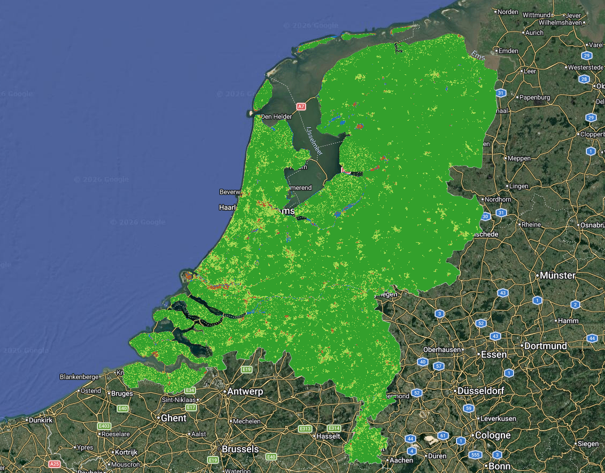
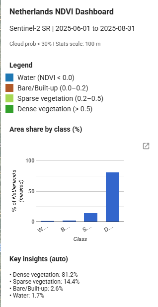

# 🇳🇱 NDVI Vegetation Analysis — Netherlands (Sentinel-2 + Google Earth Engine)

This project maps and classifies vegetation conditions across the **Netherlands** using **NDVI (Normalized Difference Vegetation Index)** from **Sentinel-2 Surface Reflectance** data in **Google Earth Engine (GEE)**.

## 🔍 What this project does
- Loads Sentinel-2 SR imagery and applies cloud masking (cloud probability)
- Builds a median composite for the selected growing-season period
- Computes NDVI using **B8 (NIR)** and **B4 (Red)**
- Classifies NDVI into 4 land/vegetation condition classes
- Calculates **area share (%)** for each class and visualizes results in a small dashboard

## 📅 Study period
- **2025-06-01 to 2025-08-31** (peak growing season)

## 🧪 NDVI classes used
| NDVI range | Class |
|---|---|
| NDVI < 0.0 | Water |
| 0.0 – 0.2 | Bare soil / Built-up |
| 0.2 – 0.5 | Sparse vegetation |
| NDVI > 0.5 | Dense vegetation |

## 📊 Key results (from the dashboard)
- 🟢 Dense vegetation: **~81%**
- 🟩 Sparse vegetation: **~14%**
- 🟤 Bare / Built-up: **~3%**
- 🔵 Water: **~1%**

> Note: NDVI indicates vegetation greenness/biomass, not crop type. Thresholds are generic and may vary by season and land cover.

## 🛰️ Data
- Sentinel-2 Surface Reflectance: `COPERNICUS/S2_SR_HARMONIZED`
- Cloud probability: `COPERNICUS/S2_CLOUD_PROBABILITY`

## 🗺️ Outputs

### NDVI Classes Map (Netherlands)

### Dashboard (NDVI + area statistics)

### Area share by NDVI class

## ▶️ How to run
1. Open Google Earth Engine Code Editor
2. Copy the script from:
   `gee_script`
3. Click **Run**
4. (Optional) Use **Tasks** to export NDVI and classified maps to Google Drive

## ⚠️ Limitations
- NDVI does not separate crop types or vegetation species
- Urban green areas may appear as vegetation
- Cloud masking and compositing choices affect results

## 🚀 Future improvements
- Seasonal comparison (spring vs summer)
- Multi-year NDVI trend analysis
- Overlay with land cover datasets (e.g., CORINE)

